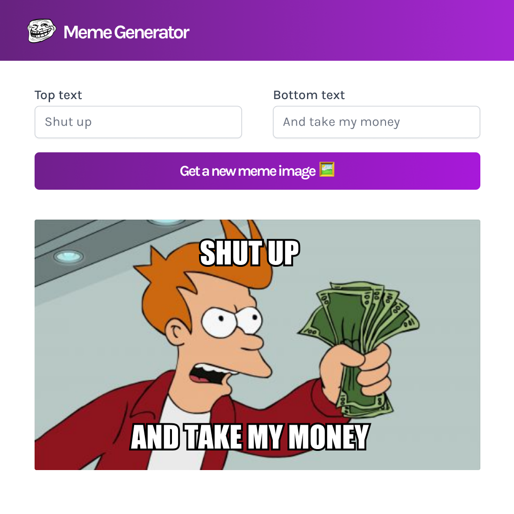

# Meme Generator App

Fun and interactive application that allows users to create memes quickly and easily, developed based on the knowledge acquired in the freeCodeCamp course.

## Overview

### The challenge

Users should be able to:

- Generate most recent memes on the internet, thanks to the Imgflip API
- Customize memes by adding text above and below the generated image
- View the optimal layout for the interface depending on their device's screen size
- See hover and focus states for all interactive elements on the page

### Links

- Repository: [github.com/valvrauu]()
- Website: [valvrauu.github.io]()

### Built with

